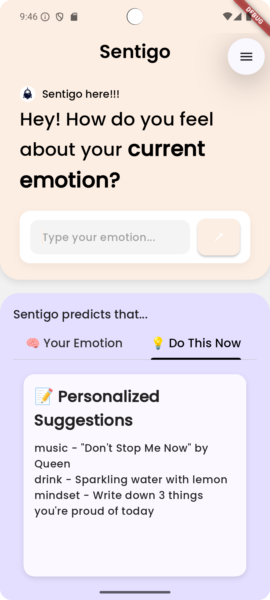

# Sentigo

Sentigo is a mobile application designed to analyze user emotions and provide personalized recommendations. It consists of two microservices (`emotion_service` and `recommendation_service`) and a Flutter-based frontend.

## Features

- **Emotion Detection**: Analyze user input to detect emotions using the `emotion_service`.
- **Personalized Recommendations**: Provide tailored recommendations based on detected emotions using the `recommendation_service`.

---


## Images
<p float="left">
  
  
</p>


## Architecture

The project is divided into three main components:

1. **Backend Microservices**:

   - **`emotion_service`**: Detects emotions from user input.
   - **`recommendation_service`**: Generates recommendations based on the detected emotion.

2. **Frontend**:

   - A Flutter application that interacts with the backend services to provide a user-friendly interface.

3. **Docker Compose**:
   - Orchestrates the microservices for easy deployment and management.

---

## Prerequisites

- Docker and Docker Compose installed on your system.
- Flutter SDK installed for frontend development.
- Android studio for running the mobile emulator and backend services

---

## Getting Started

### 1. Clone the Repository

```bash
git clone https://github.com/sreyas-b-anand/sentigo
cd sentigo
```
### 2. ENV setup
- Create a .env file in recommendation_service folder and paste the below code in it . You need an api key from <link>https://mistral.ai/</link>
```bash
'MISTRAL_API_KEY'='YOUR API KEY'
```

- Create a .env file in frontend folder and paste the below code in it
```bash
FLUTTER_APP_EMOTION_SERVICE=your_backend_url/get_emotion
FLUTTER_APP_RECOMMENDATION_SERVICE=your_backend_url/get_recommendation
```

### 3. Backend Setup
```bash
cd backend
docker-compose up --build
```
 * This will:

  - Start the emotion_service on port 5000.
  - Start the recommendation_service on port 5001.

### 4. Frontend setup
```bash
cd frontend
flutter pub get
```

* This will install the required dependencies

### 5. Run the application
```bash
flutter run
```
